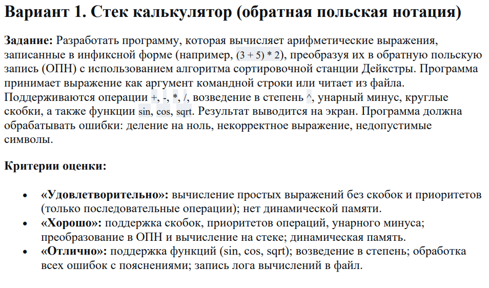
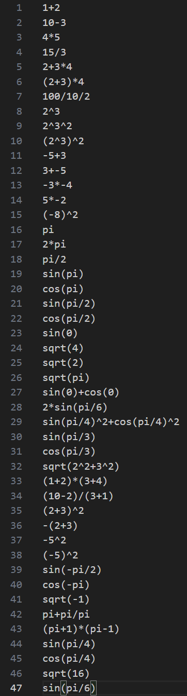
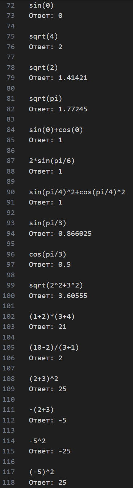
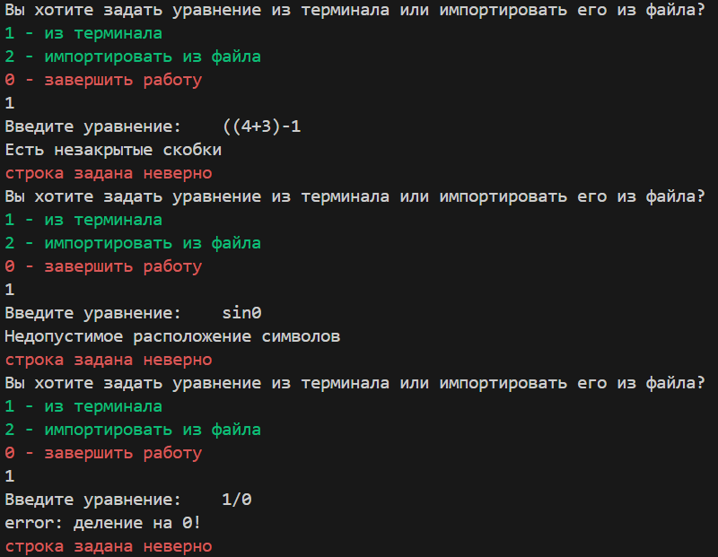

# Задание РГР

## Анализ задачи и алгоритмы решения

    Алгоритм Дейкстры и обратной польской записи за один проход

    - Input: строка
    - Output: число

    Если элемент - число, то оно сразу кладётся в стек чисел.
    Если элемент - знак, то
        - если стек операций пуст, сразу кладём туда знак;
        - если знаком является открывающая скобка, то кладём 
            её в стек операций. Так как она имеет приоритет 0, 
            происходит обнуление приоритетов;
        - если знаком является закрывающая скобка, то 
            вытаскиваем из стека все операции, выполняя их.
            Проводим данные действия пока не вытащим открывающую
            скобку;
        - если знаком является обычная операция, то сверяем
            приоритеты по словарю. Если приоритет данной операции
            выше приоритета операции, лежащей    на вершине стека,
            кладём в стек.
            Иначе берём последнюю операцию из стека операций и
            2 числа из стека чисел, проводим соответствующее
            действие, после чего результат кладём в стек чисел,
            а новую операцию - в стек операций.
    Если строка закончилась, вытаскиваем все операции по одной
    из стека операций и проводим соответствующие действия над
    последними двумя числами стека чисел, после чего результат
    кладём обратно в стек чисел. Делаем данные действия, пока
    стек операций не опустеет.

    Валидатор входных данных

    На вход получает исходную строку, содержащую выражение. 
    Проверяет:
        - корректность количества идущих подряд операций;
        - деление на 0;
        - корректность работы с float;
        - наличие корней, синусов или косинусов. В случае 
        их присутствия в выражении, они заменяются на 
        'r', 's' и 'c' соответственно;
        - закрытие скобок.

    - Преобразует унарный минус в "~", что бы в алгоритме 
        Дейктсры было чёткое отличие от обычного минуса;
    - Обрабатывает число pi.

## Набор корректных данных

## Результат

## Некорректные данные

