## 2 потока, которые выводят одинаковые строки
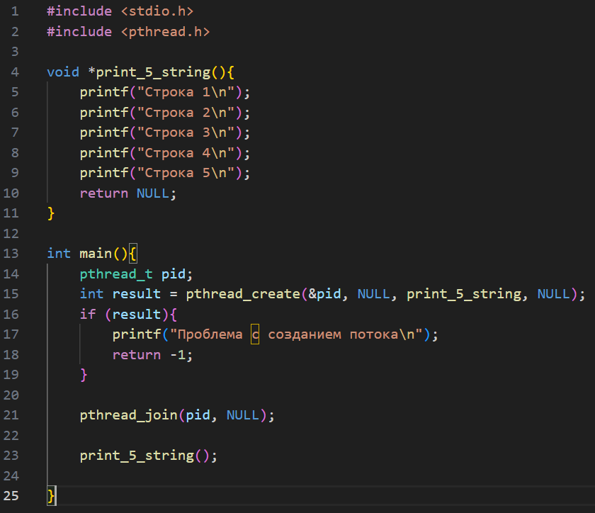

## 5 потоков. каждый из 4 дочерних выводят разные строки
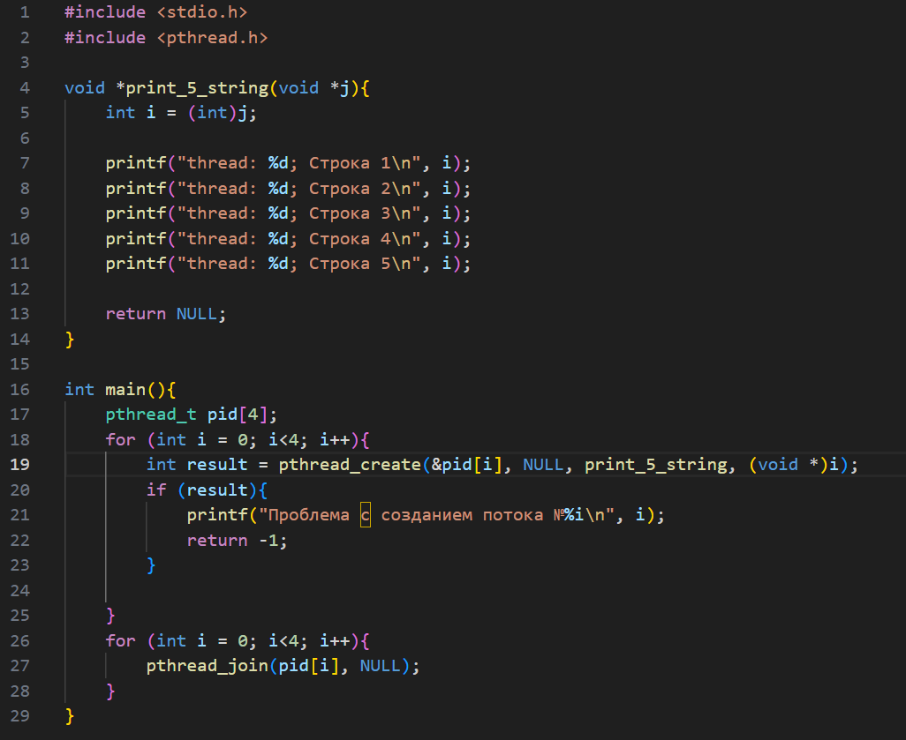

## дочерние процессы выводят строку с интервалом в секунду. через 2 секунды родительский процесс убивает все дочерние при помощи pthread_cancel()
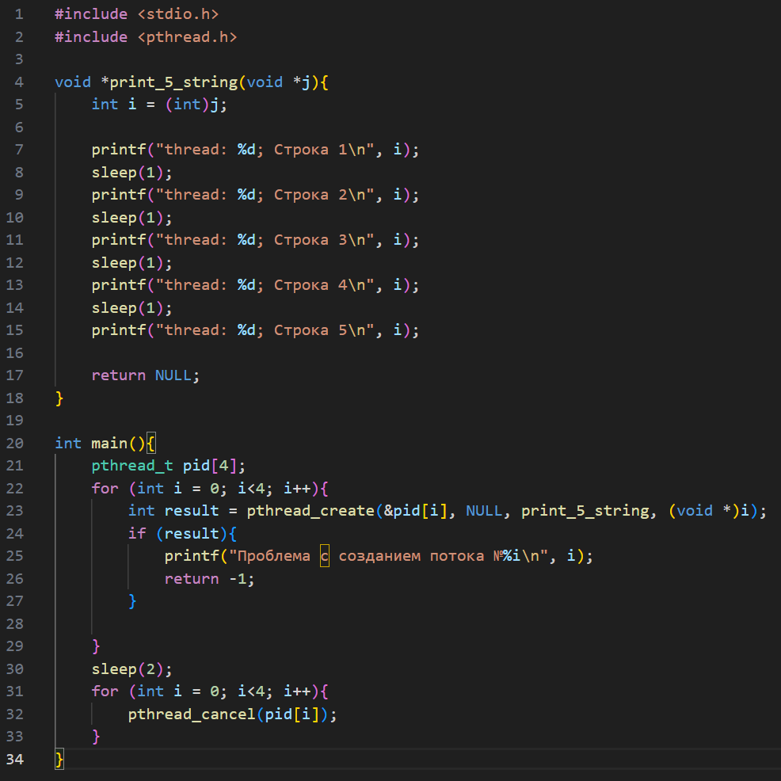

## вывод сообщение через отдельную функцию, которую вызывает pthread_cleanup_push. pthread_cleanup_pop пишется всегда, когда есть pthread_cleanup_push - он как закрывающая конструкция
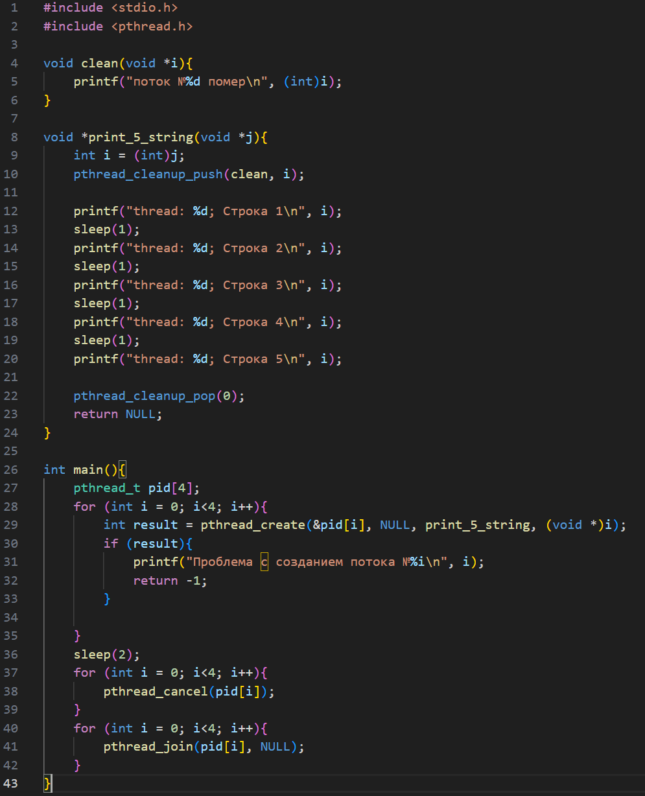

## сортировка, которая создаёт n потоков
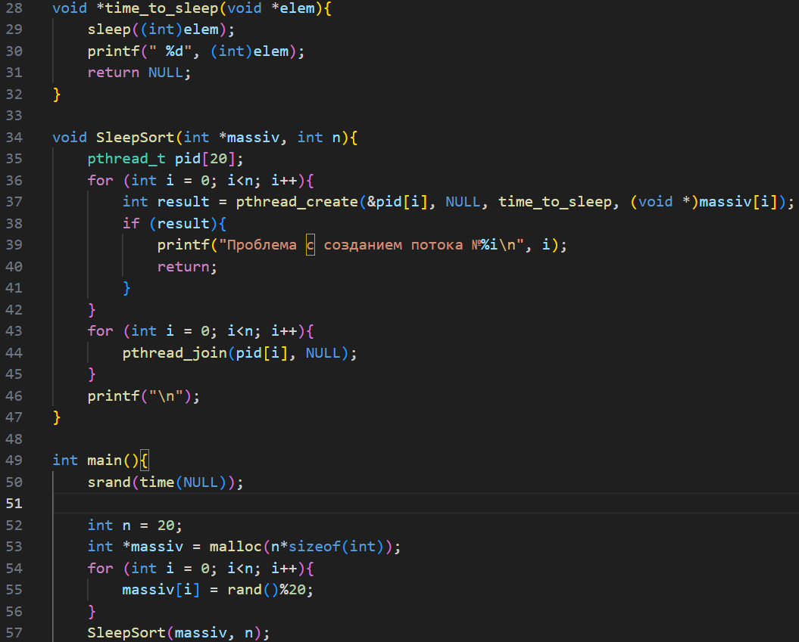

## в начале программы блокирую поток, который активирует дочерний printf. в процессе работы программы мьючу и размьючу потоки, тем самым предотвраща гонку потоков и делая критическую секцию безопасной
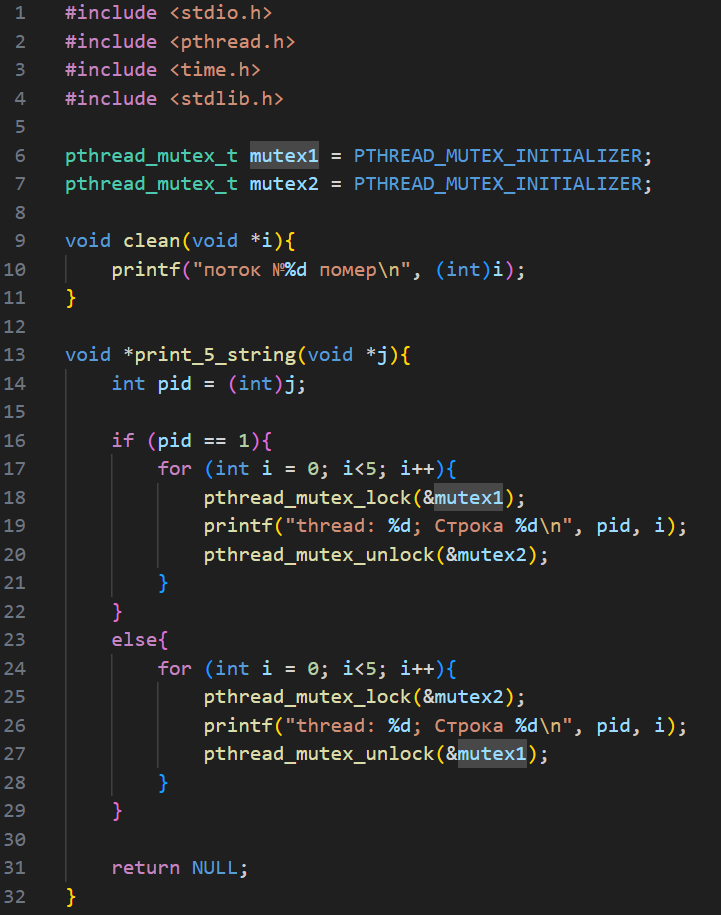
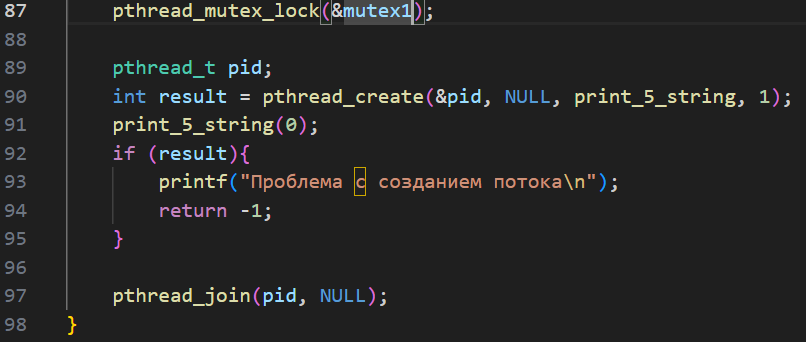

## заполняю 3 матрицы, распределяю строки по потокам. потоки перемножают строку на строку (так как матрица симметрична, то она транспонирована). в функцию передаю параметры, используя структуру. измеряю время
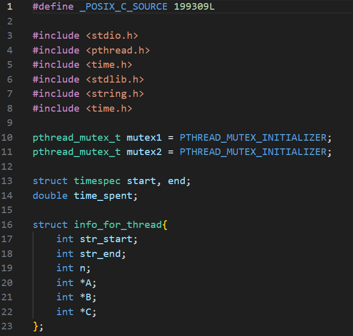
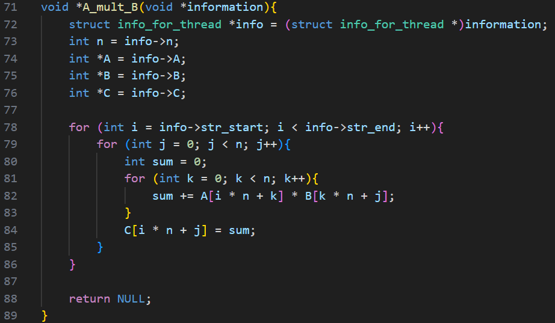
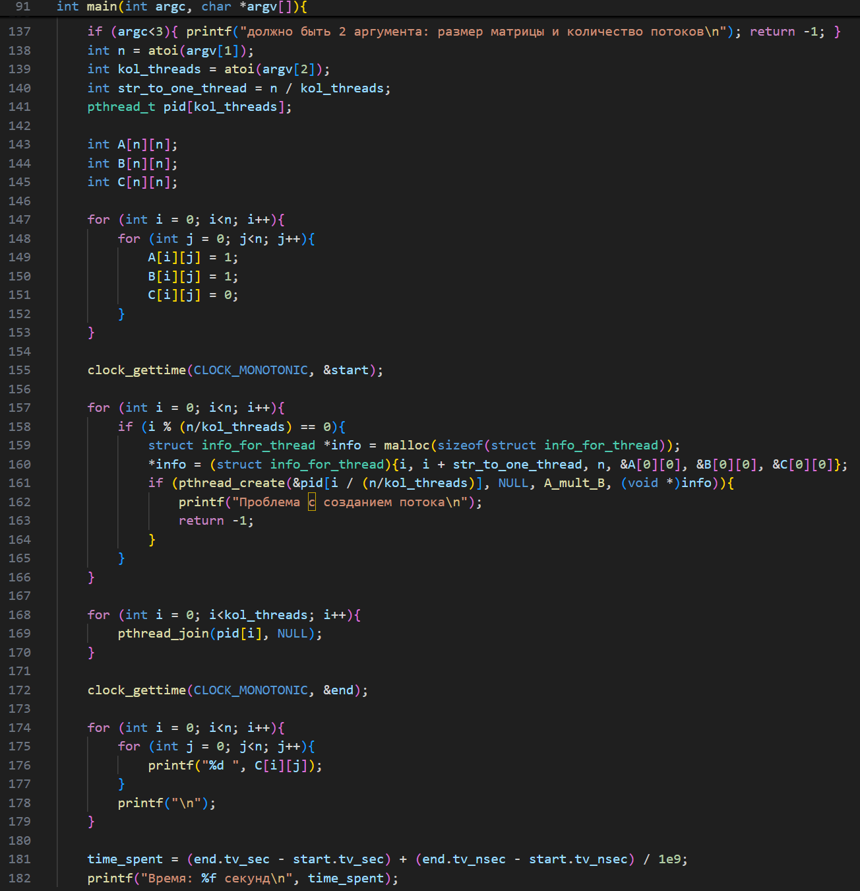
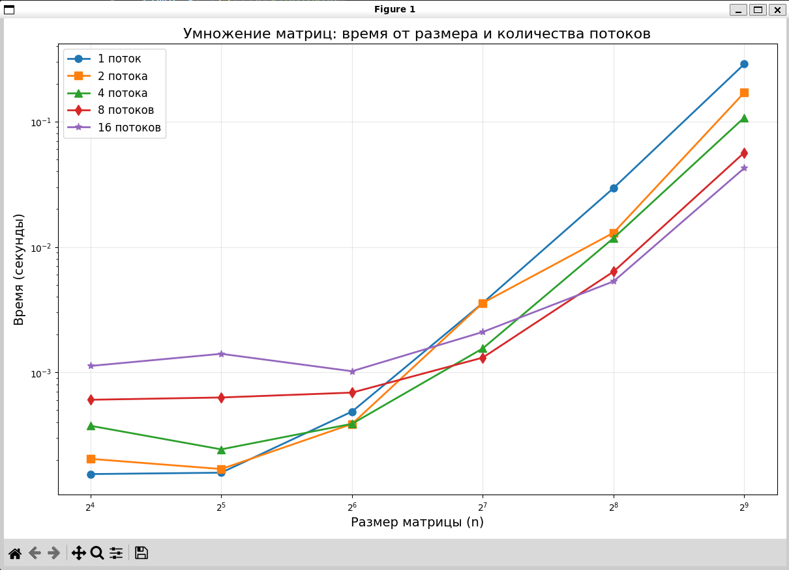